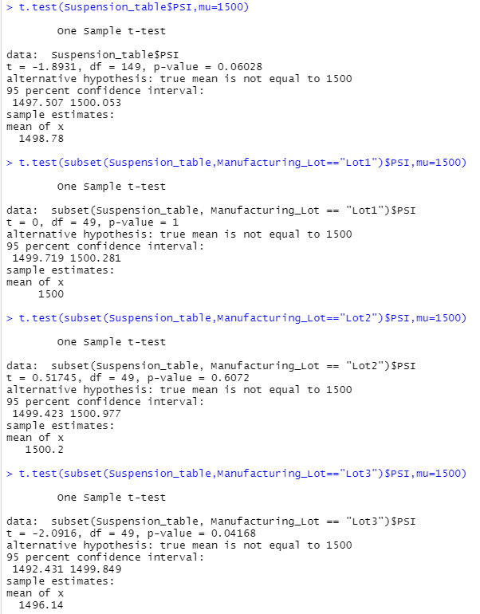

# MechaCar_Statistical_Analysis

## Linear Regression to Predict MPG
- Which variables/coefficients provided a non-random amount of variance to the mpg values in the dataset? vehicle_length and ground_clearance
- Is the slope of the linear model considered to be zero? Why or why not? The slope is not zero because there are 2 significant predictors. 
- Does this linear model predict mpg of MechaCar prototypes effectively? Why or why not? Yes, it is explained 71.49% of the model, and the model is significant because the p-value of the model is smaller than 0.05.

## Summary Statistics on Suspension Coils
Lot 1 and 2 are acceptable variances, and lot 3 aren't, but when we look at them all combined, it will appear that they are all in the acceptable variance.

## T-Tests on Suspension Coils
See the results of the t-test below. We can see that lot1 and lot2 are not statistically different from the population mean.
And lot3 it is statistically different because the p-value is below the significant value of 0.05 (0.04168).

## Study Design: MechaCar vs Competition
One of the important things about buying a car is the safety rating. The safety rating is a common performance metric reported based on safety tests. 
Therefore it would be very simple to check these safety ratings from the federal government and the Insurance Institute for Highway Safety and collect safety rating data for a large number of vehicles.
I suggest testing whether or not the safety rating of MechaCar is statistically different from a collection of other comparable vehicles.
Null hypothesis- there is no statistical difference between MechaCar safety rating and the safety rating of other comparable vehicles.
The Alternative hypothesis is that there is a statistical difference between MechaCar's safety rating and other vehicles. And the Mechacar safety rating is much higher or lower comper to other comparable vehicles.
The statistical test we can use is a one-sample t-test, where the population data will be all comparable vehicles.
To test this, we will need multiple safety rating data points from vehicles and multiple data points from the MechaCar vehicles, so it
will be important to include the safety ratings of multiple vehicle configurations.
